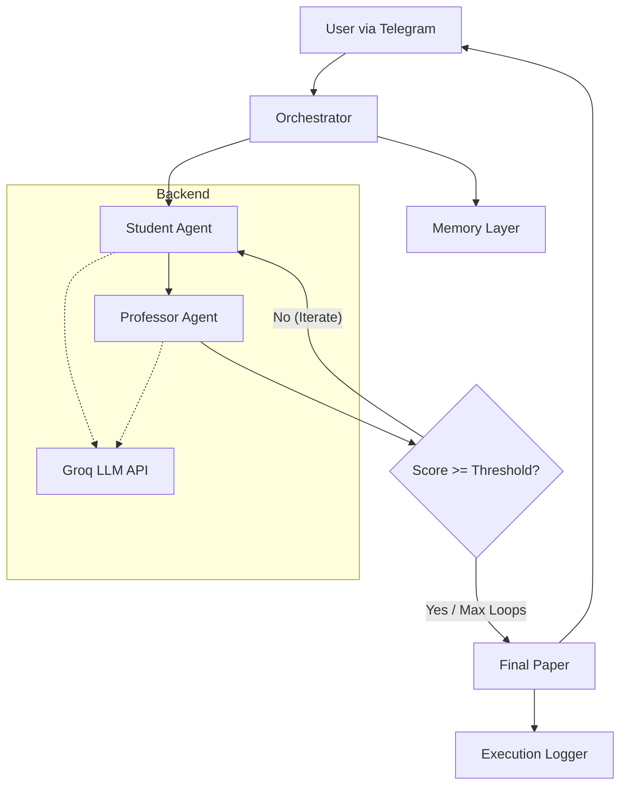

# 🧠 Multi-Agent Agentic Research System

This project is a bounded, multi-agent AI system designed to autonomously draft, critique, revise, and evaluate research papers. By implementing structured orchestration and reflective reasoning loops, it moves beyond simple prompt engineering into the realm of **Production-Aware Agentic Design**.

---

## 🚀 Project Overview

The system demonstrates controlled AI autonomy through a modular architecture where specialized agents collaborate to achieve high-quality academic outputs. 

### Core Components
* 🎓 **Student Agent**: Generates structured academic drafts based on initial prompts.
* 👨‍🏫 **Professor Agent**: Provides rubric-based critiques and evaluations.
* 🧭 **Orchestrator**: The "brain" of the system—manages state, iteration loops, and termination.
* 💾 **Memory Layer**: A lightweight persistence layer for historical context (JSON-based).
* 📊 **Execution Logger**: Captures metadata, quality scores, and latency for observability.
* 🤖 **Telegram Interface**: Provides a real-time, user-facing interaction layer.

---

## 🏗 System Architecture

The Orchestrator manages the flow of information between agents and ensures the system respects the defined iteration boundaries.

🧩 What Makes This "Agentic"?
Unlike standard LLM chains, this system introduces behaviors that define true agentic design:
Role Specialization: Agents have distinct personas, constraints, and rubrics.
Reflective Reasoning: The system critiques its own output and performs targeted revisions.
Bounded Autonomy: Logic-gated loops (max 2 iterations) prevent infinite loops and control costs.
State Management: The Orchestrator tracks document evolution across multiple rounds.
Observability: Every decision and score is logged as a timestamped JSON for auditing.

🔁 Execution Flow
Input: User submits a research topic via Telegram.
Context: Orchestrator retrieves relevant keywords from the Memory Layer.
Drafting: The Student Agent generates the first version of the paper.
Critique: The Professor Agent evaluates the draft against an academic rubric.
Iteration: If feedback is "REVISE", the Student Agent receives the critique and updates the paper.
Termination: The loop ends when the Professor approves or the 2-iteration cap is reached.
Finalization: The system logs metadata, updates memory, and delivers the final result.

📊 Execution MetadataEvery run is captured in a timestamped log to track performance:
MetricDescriptionQuality ScoreNumerical evaluation (1-10) provided by the Professor AgentIteration CountTotal number of revision rounds performedLatencyTotal execution time in secondsMemory SyncKeywords extracted for future contextual relevanceModelThe specific LLM used (e.g., Llama-3.1-8b via Groq)

🛠 Installation & Setup
1. Clone the RepositoryBashgit clone [https://github.com/your-username/multi-agent-research-system.git](https://github.com/your-username/multi-agent-research-system.git) cd multi-agent-research-system
2. Install DependenciesBashpip install -r requirements.txt
3. Environment ConfigurationCreate a .env file in the root directory:Code snippetGROQ_API_KEY=your_groq_api_key
TELEGRAM_BOT_TOKEN=your_telegram_bot_token
4. Run the SystemBashpython -m bot.student_bot

OR just access the bot at - [tg_bot](t.me/ReseachAgent_bot)

⚠️ Known LimitationsNo Tool Use:
Currently lacks live web search capabilities (No RAG).
Keyword Memory: Uses JSON storage instead of a Vector Database (FAISS/Pinecone).Stateless 
Agents: Agents do not "remember" sessions; the Orchestrator handles all state.

🏗 Scalability Roadmap
[ ] Vector Memory: Transition to semantic retrieval for better context injection.
[ ] RAG Integration: Add a Search Tool (Tavily or Serper) for real-time data.
[ ] Multi-Model Routing: Use Llama-3.1-70b for evaluation and 8b for drafting.
[ ] Containerization: Full Docker support for cloud-ready deployment.

💡 Use Cases
Academic Drafting: Rapidly generating literature reviews and outlines.
Enterprise QA: Autonomous quality assurance for technical documentation.
Legal Memos: Drafting and internal peer-reviewing of legal summaries.
Content Strategy: Structured whitepaper generation with built-in editorial oversight.
