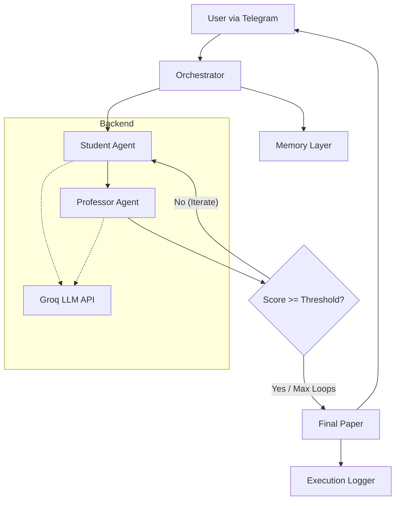

# 🧠 Multi-Agent Agentic Research System


This project is a bounded, multi-agent AI system designed to autonomously draft, critique, revise, and evaluate research papers. By implementing structured orchestration and reflective reasoning loops, it moves beyond simple prompt engineering into the realm of **Production-Aware Agentic Design**.

---

## 🚀 Project Overview

The system demonstrates controlled AI autonomy through a modular architecture where specialized agents collaborate to achieve high-quality academic outputs. 

### Core Components
* 🎓 **Student Agent**: Generates structured academic drafts based on initial prompts.
* 👨‍🏫 **Professor Agent**: Provides rubric-based critiques and evaluations.
* 🧭 **Orchestrator**: The "brain" of the system—manages state, iteration loops, and termination.
* 💾 **Memory Layer**: A lightweight persistence layer for historical context (JSON-based).
* 📊 **Execution Logger**: Captures metadata, quality scores, and latency for observability.
* 🤖 **Telegram Interface**: Provides a real-time, user-facing interaction layer.

---

## 🏗 System Architecture

The Orchestrator manages the flow of information between agents and ensures the system respects the defined iteration boundaries.



## 🧩 What Makes This "Agentic"?

Unlike standard LLM chains, this system introduces behaviors that define true agentic design:

### 🔹 Role Specialization
Agents have distinct personas, constraints, and rubrics:
- **Student Agent** → Drafts research papers
- **Professor Agent** → Evaluates using academic rubric
- **Orchestrator** → Manages workflow & state

### 🔹 Reflective Reasoning
The system critiques its own output and performs targeted revisions based on feedback.

### 🔹 Bounded Autonomy
Logic-gated loops (max **2 iterations**) prevent infinite loops and ensure cost predictability.

### 🔹 State Management
The Orchestrator tracks document evolution across multiple rounds.

### 🔹 Observability
Every decision and score is logged as timestamped JSON for auditing and analysis.

---

## 🔁 Execution Flow

1. **Input**  
   User submits a research topic via the Telegram Bot.

2. **Context Retrieval**  
   Orchestrator retrieves relevant keywords from the Memory Layer.

3. **Drafting**  
   Student Agent generates the first version of the paper.

4. **Critique**  
   Professor Agent evaluates the draft using a formal academic rubric.

5. **Iteration**  
   If feedback = `REVISE`, Student Agent updates the paper.

6. **Termination**  
   Loop ends when:
   - Professor approves, OR
   - 2-iteration cap is reached.

7. **Finalization**  
   System logs metadata, updates memory, and returns final output.

---

## 📊 Execution Metadata

Each run generates a timestamped log containing:

| Metric | Description |
|--------|------------|
| **Quality Score** | Numerical evaluation (1–10) by Professor Agent |
| **Iteration Count** | Total revision rounds |
| **Latency** | Execution time in seconds |
| **Memory Sync** | Keywords extracted for future context |
| **Model** | LLM used (e.g., Llama-3.1-8B via Groq) |

---

## 🛠 Installation & Setup

### 1️⃣ Clone the Repository    
git clone https://github.com/nishb2715/agentic-multi-agent-ai-system
cd agentic-multi-agent-ai-system


###2️⃣ Install Dependencies
pip install -r requirements.txt

###3️⃣ Environment Configuration
Create a .env file in the root directory:
GROQ_API_KEY=your_groq_api_key
TELEGRAM_BOT_TOKEN=your_telegram_bot_token


###4️⃣ Run the System
python -m bot.student_bot


##🤖 Live Demo

👉 Access the Telegram bot:
[https://t.me/ResearchAgent_bot](https://t.me/ReseachAgent_bot)


##⚠️ Known Limitations

###❌ No live web search (RAG not integrated yet)

###📦 Keyword memory uses JSON instead of vector DB

###🧠 Agents are stateless; Orchestrator manages memory

##🏗 Scalability Roadmap

### Vector Memory — FAISS / Pinecone semantic retrieval

### RAG Integration — Tavily / Serper search tool

 ###Multi-Model Routing — 70B for evaluation, 8B for drafting

### Containerization — Docker for cloud deployment

##💡 Use Cases

###📚 Academic Drafting — Literature reviews & outlines

###🏢 Enterprise QA — Documentation quality checks

###⚖️ Legal Memos — Drafting & peer review

###📈 Content Strategy — Structured whitepaper generation


```bash
git clone https://github.com/nishb2715/agentic-multi-agent-ai-system
cd agentic-multi-agent-ai-system
